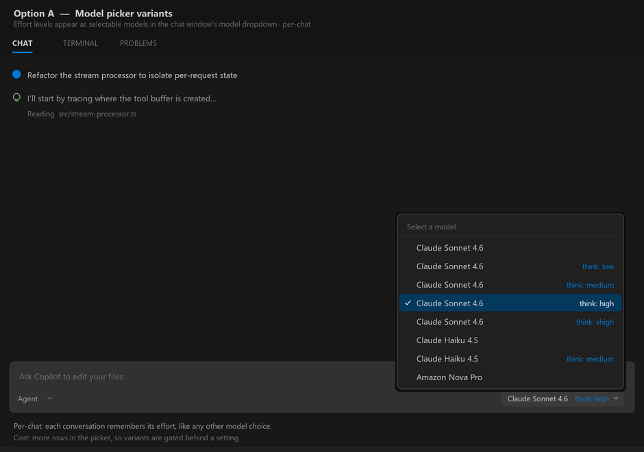
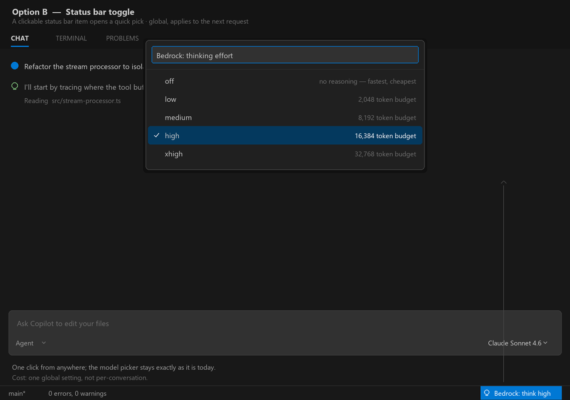
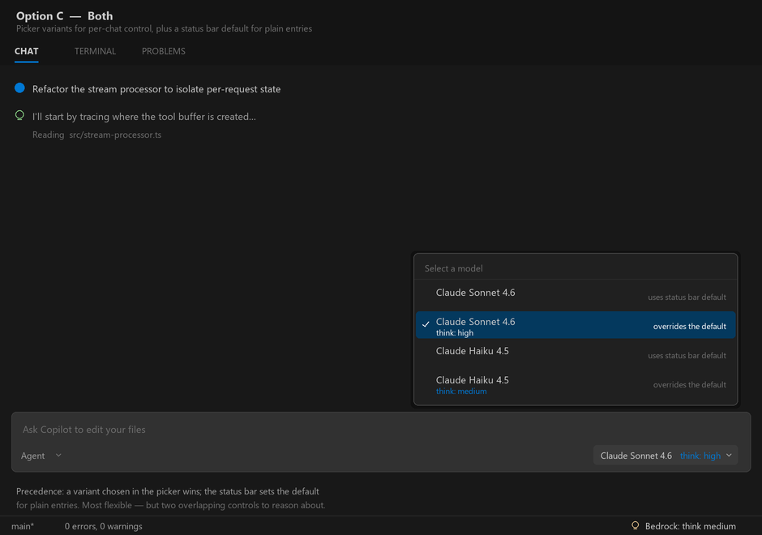
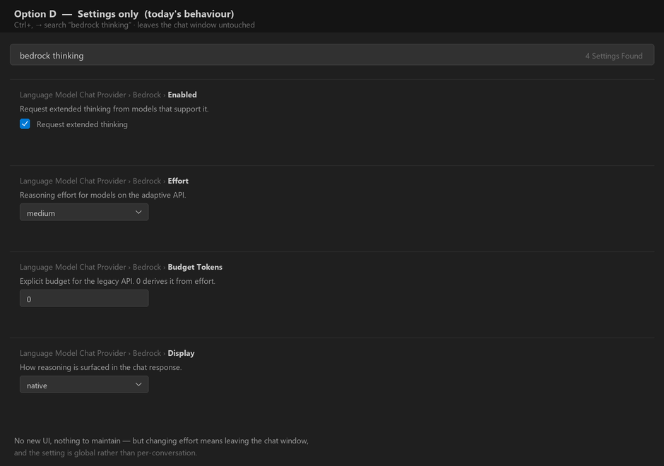

# Thinking-effort UI: the options that were considered

Extended thinking landed with its effort level configurable only in the settings
editor, which is a poor fit for a knob you want to turn several times an hour.
These four mockups were drawn to decide where the control should live. They are
illustrative renderings, not screenshots of a build.

The constraint that shapes all of them: **VS Code gives a language model provider
no API for contributing UI to the chat input box.** `modelOptions` on a request is
readonly and populated by the caller, so a provider cannot add a control there.
The model list returned from `provideLanguageModelChatInformation` is the only
lever inside the chat window itself; everything else has to live in ordinary
extension surfaces such as the status bar.

| | Option | Scope of the setting |
| --- | --- | --- |
|  | **A — Model picker variants.** Each reasoning model appears once per effort level. | Per conversation, since VS Code remembers the model per chat. |
|  | **B — Status bar toggle.** A status bar item opens a quick pick. | Global. |
|  | **C — Both.** Variants override a status bar default. | Both. |
|  | **D — Settings only.** The behaviour as shipped. | Global. |

**Option C was chosen and implemented.** The two halves are complementary rather
than redundant: the status bar covers the common case of changing the default for
everything, and the picker variants cover running two conversations at different
efforts at once — which nothing else can express. The variants are off by default
(`thinking.showEffortVariants`) because they multiply the length of a list people
already know, and with them off the behaviour collapses cleanly to Option B.

Precedence is a single rule: a variant picked in the chat window wins, and
anything else falls back to the global default, which can itself be off.

See **Choosing an effort level** in the [README](../../README.md#choosing-an-effort-level)
for how it ended up working, and [docs/screenshots/](../screenshots/) for what the
built version actually looks like. The screenshots supersede these drawings
wherever the two disagree.
